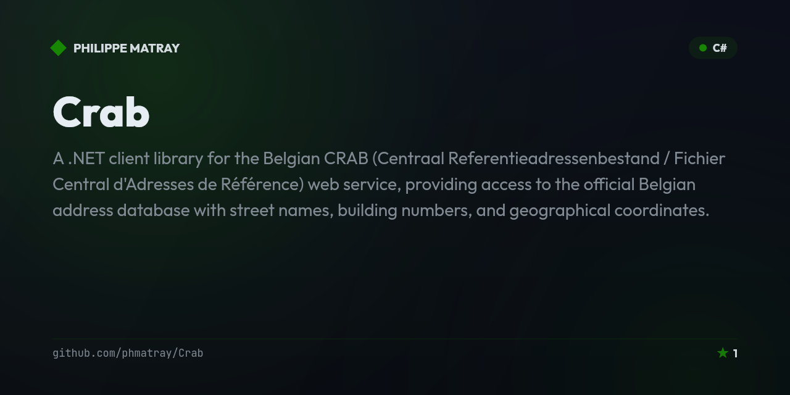

# Crab — Belgian CRAB address API client for .NET

<!-- portfolio-badges:start -->
<!-- Identity -->
[](https://github.com/phmatray/Crab)

[](https://github.com/phmatray/Crab/stargazers)
[](https://github.com/phmatray/Crab/network/members)

<!-- Activity -->
[](https://github.com/phmatray/Crab/issues)
[](https://github.com/phmatray/Crab/pulls)
[](https://github.com/phmatray/Crab/commits)
<!-- portfolio-badges:end -->


A .NET client library for the Belgian CRAB (Centraal Referentieadressenbestand / Fichier Central d'Adresses de Référence) web service, providing access to the official Belgian address database with street names, building numbers, and geographical coordinates.

## ✨ Features
- Access to Belgian official address reference data
- Street name and house number lookups
- Geographical coordinate retrieval for addresses
- Municipality and postal code queries
- SOAP/REST API client abstractions

## 📦 Installation
```bash
dotnet add package Crab
# or
git clone https://github.com/phmatray/Crab
```

## 🚀 Quick Start
```csharp
var client = new CrabClient();
var addresses = await client.GetAddressesByStreetAsync("Rue de la Loi", "Bruxelles");
foreach (var address in addresses)
    Console.WriteLine($"{address.StreetName} {address.HouseNumber}, {address.Municipality}");
```

## 📄 License
MIT — see LICENSE
